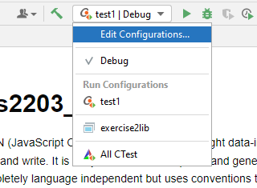

# ais2203_exercise2

>JSON (JavaScript Object Notation) is a lightweight data-interchange format. 
It is easy for humans to read and write. It is easy for machines to parse and generate.
JSON is a text format that is completely language independent but uses conventions that
are familiar to programmers of the C-family of languages, including C, C++, C#, Java, 
JavaScript, Perl, Python, and many others. 
These properties make JSON an ideal data-interchange language.

# Problem statement

You are given a project that should compile successfully.
However, the projects unit-test(s) __fails__.

>In computer programming, unit testing is a software testing method by which individual 
units of source code—sets of one or more computer program modules together with 
associated control data, usage procedures, 
and operating procedures—are tested to determine whether they are fit for use.

This project uses [Catch2](https://github.com/catchorg/Catch2) for enabling these tests.
The actual tests are located in th `/test` folder. 
However, you are not supposed to change them during this exercise.

Rather, you are supposed to fix the source of the error. 
Note that the test(s) are executable files that can run.

---

In order to fix the underlying issue, you need to read the documentation of a 
third-party library and understand how to use it. 
Basically you are tasked with decoding a JSON file/text in C++. 
A header-only JSON library is provided for you called [nlohmann/json](https://github.com/nlohmann/json).

Good luck, have fun!

_PS. Be sure to understand the layout of the project, and try to understand how in the heck you suddenly 
have access to an external JSON library and Unit test framework._
